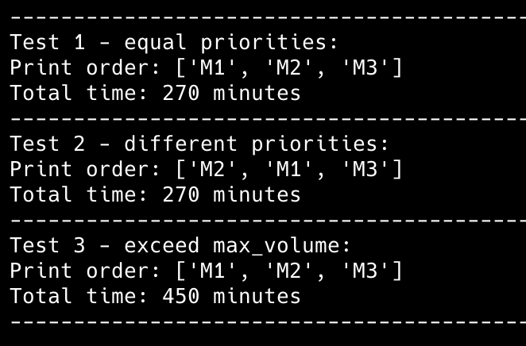
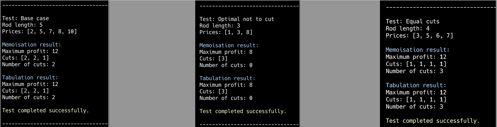

# goit-algo2-hw-02

Design and Analysis of Algorithms: Applied a Greedy algorithm to optimize a 3D printer queue, ensuring efficient resource utilization. Utilized a dynamic programming approach to determine the optimal solution for the Rod Cutting Problem.

# Task 1.

We have a 3D printer with constraints on max volume and max total number of printing jobs. Using Greedy algorithm we optimize printing queue and obtain the next results:

# Task 2.

Implemented the Rod Cutting problem using Dynamic Programming techniques, including memoization and tabulation, to determine the optimal solution. Both approaches were analyzed and compared in terms of efficiency and performance.

The results of testing both methods are as follows:

